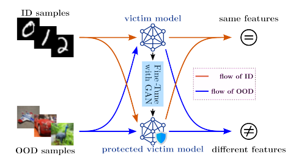
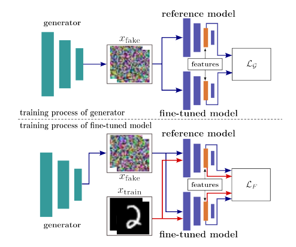
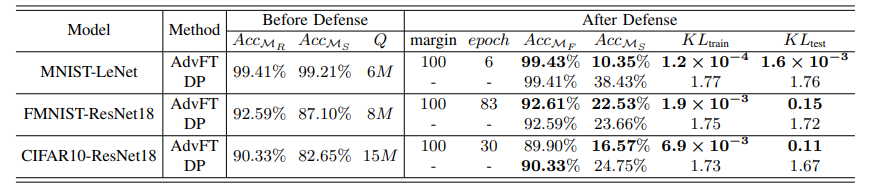
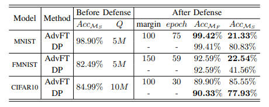
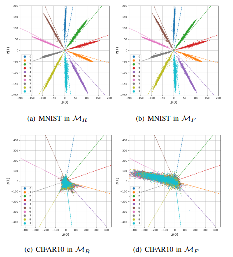

# AdvFT: Adversarial Fine-Tuning against DNN Model Extraction

## About 
 We proposed a novel framework for the defense against model extraction, which offers the possibility to degrade the performance of the surrogate model without sacrificing victim model fidelity. Specifically, AdvFT will interfere with the features of the fake (generated by GAN) by adjusting the model weights to achieve the purpose of disturbing the internal mapping of OOD samples while maintaining ID samples, without extra natural OOD samples used. 




## Model Architecture

## Installation
Environments: This project uses python=3.8.8 and pytorch=1.7.1

Datasets: Download the datasets and put them into the path of 
>'./AdvFT-master/Dataset'
## Quick start
### Training of reference model and fine-tuning of fine-tuned model.
```shell
python AdvFT-master/main.py
```
If there is already a pretrained pt file of reference model, please comment out the code blow in the 41th line of main.py.
```python
train_model_R(args, Victim_model, train_set, test_set, train_loader, test_loader)
```
Note that different data has different training ways (in 61th line of main.py)
>MNIST and Fashion-MNIST use the Adam and set the learning rate of 0.0001

>CIFAR10 uses the SGD and set the learning rate of 0.0001

### Testing the defense performance of AdvFT and DP against DFME and KnockoffNets attack.
#### DFME
```shell
python AdvFT-master/Attacks/DFME.py
```
Note that there are two parameters need to set before testing.

pt file of reference model in 24th line of DFME.py.
```python
parser.add_argument('--pt_file',type=str,default='../Trained/Mnist_Lenet_epoch_59_accuracy_99.44%.pt')
```
whether poisoning with DP in 30th line of DFME.py.
```python
parser.add_argument('--poison',type=bool,default=True,help='whether poisoning with DP')
```
When testing the performance of AdvFT, please using the pt file in fhe fold of 
>AdvFT-master/Trained/after_fine_tune

and setting the parameter of poison as False.
#### KnockoffNets
```shell
python AdvFT-master/Attacks/KnockoffNets.py
```
Same as DFME, setting the parameters of pt_file and poison at first, and remember to prepare the surrogate data, usually a folder with ImageNets images.
```python
parser.add_argument('--query_set', type=str, default='F:/Python_Project/Data-Agnostic_DNN_Model_Protection/Knockoff/dataset/Imagenet_100K', help='setting the path of ImageNet')
```
### Drawing the pictures
#### feature maps
```shell
python AdvFT-master/Draw/feature_map.py
```
Note to set the pt files of reference model and fine-tuned model before.
#### consistency between fine-tuned epoch and the accuracy of surrogate model
```shell
python AdvFT-master/Draw/M_S_accuracy_epoch.py
```
### Main results
The experiment results of AdvFT and DP against DFME



The experiment results of AdvFT and DP against KnockoffNets



The feature maps 



